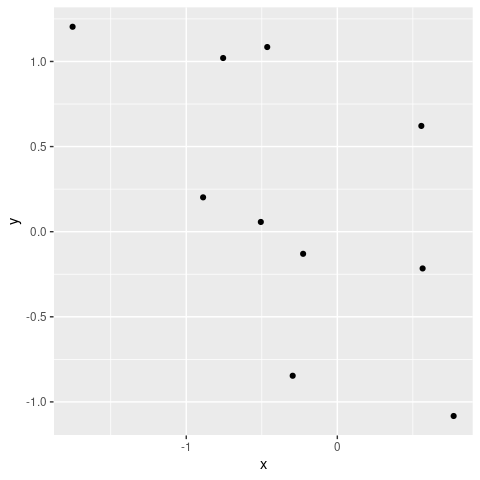

# Parallel Processing using the future package in R

## 1. Overview: Futures and the R future package

What is a future? It’s basically a flag used to tag a given operation
such that when and where that operation is carried out is controlled at
a higher level. If there are multiple operations tagged then this allows
for parallelization across those operations.

According to Henrik Bengtsson (the package developer) and those who
developed the concept:

-   a future is an abstraction for a value that will be available later
-   the value is the result of an evaluated expression
-   the state of a future is either unresolved or resolved

### Why use futures?

The future package allows one to write one’s computational code without
hard-coding whether or how parallelization would be done. Instead one
writes the code in a generic way and at the top of one’s code sets the
*plan* for how the parallel computation should be done given the
computational resources available. Simply changing the *plan* changes
how parallelization is done for any given run of the code.

More concisely, the key ideas are:

-   Separate what to parallelize from how and where the parallelization
    is actually carried out.
-   Different users can run the same code on different computational
    resources (without touching the actual code that does the
    computation).

## 2. Overview of parallel backends

One uses `plan()` to control how parallelization is done, including what
machine(s) to use and how many cores on each machine to use.

For example,

``` r
## spread work across multiple (all available) cores
## based on result of `parallelly::availableCores()`:
plan(multisession)  
## also, explicitly can control number of workers
plan(multisession, workers = 4)
```

This table gives an overview of the different plans.

| Type         | Description                                               | Multi-node | Copies of objects made?    |
|--------------|-----------------------------------------------------------|------------|----------------------------|
| multisession | background R processes                                    | no         | yes                        |
| multicore    | forked R processes (not available in Windows nor RStudio) | no         | not if object not modified |
| remote       | R process on another machine                              | yes        | yes                        |
| cluster      | R processes on other machine(s)                           | yes        | yes                        |

For the next section (Section 3), we’ll just assume use of
`multisession` and will provide more details on the other plans in the
following section (Section 4).

The deprecated `multiprocess` plan used either `multisession` on Windows
and `multicore` on MacOS/Linux.

## 3. Implementing operations in parallel

The future package has a few main patterns for how you might parallelize
a computation.

### 3.1. Parallelized lapply statements and related

You can parallelize lapply and related functions easily. This is a nice
replacement for the confusingly similar set of such as `parLapply`,
`mclapply`, and `mpi.parSapply`.

``` r
library(future.apply)
plan(multisession)  # or some other plan
output <- future_lapply(1:20, function(i) mean(rnorm(1e7)), future.seed = TRUE)
# or sapply:
# output <- future_sapply(1:20, function(i) mean(rnorm(1e7)), future.seed = TRUE)
```

Alternatively, you can use `furrr:future_map` to run a parallel map
operation (i.e., taking an explicit functional programming perspective).

### 3.2. foreach

You can also continue to use `foreach` if you like that approach.

``` r
plan(multisession)  # or some other plan

library(doFuture, quietly = TRUE)
registerDoFuture()

out <- foreach(i = 1:5) %dopar% {
    cat("Running in process", Sys.getpid(), "\n")
    mean(1:i)
}
```

    ## Running in process 87724 
    ## Running in process 87723 
    ## Running in process 87722 
    ## Running in process 87721 
    ## Running in process 87725

``` r
out
```

    ## [[1]]
    ## [1] 1
    ## 
    ## [[2]]
    ## [1] 1.5
    ## 
    ## [[3]]
    ## [1] 2
    ## 
    ## [[4]]
    ## [1] 2.5
    ## 
    ## [[5]]
    ## [1] 3

### 3.3. Using futures for parallelization

While `future_lapply` and `foreach` are fine, the future package
introduces a new style of parallelizing code using an explicit “future”.
Here we include the code for individual iterations inside `future()` to
mark the unit of computation. The future package will then distribute
the individual iterations to run in parallel, based on the plan.

(Here the code is safe in terms of parallel randon number generation
because of the `seed` argument - see Section 8 for more details.)

``` r
plan(multisession)   # or some other plan
n <- 20
out <- list(); length(out) <- n

for(i in seq_len(n)) {
     out[[i]] <- future( {
       ## simply insert code here as you would with foreach; for example:
       tmp <- rnorm(1e7)
       c(mean(tmp), sd(tmp))
     }, seed = TRUE)
}
class(out[[5]])
```

    ## [1] "MultisessionFuture" "ClusterFuture"      "MultiprocessFuture"
    ## [4] "Future"             "environment"

``` r
## Each return values (e.g., 'out[[1]]') is a wrapper, so use value() to access:
value(out[[5]])
```

    ## [1] -0.0009148784  0.9997338352

### 3.4. Using implicit futures (with listenvs)

In addition to using `future()`, one can use the special `%<-%` operator
to denote a future. The `%<-%` operator can only operate with an
environment. So we create a `listenv`, which is basically an environment
that can be treated like a list.

This approach creates implicit futures, and one does not need to use
`value` to get the result.

(Note that, as seen in the warnings, the code here is not safe in terms
of parallel randon number generation - see Section 8 for more
information.)

``` r
library(listenv)

plan(multisession, workers = 4)
n <- 20
out <- listenv()
for(i in seq_len(n)) {
     out[[i]] %<-% {
       # some code here as you would with foreach; for example:
       tmp <- rnorm(1e7)
       c(mean(tmp), sd(tmp))
     }
}

out[[2]]
```

    ## Warning: UNRELIABLE VALUE: Future ('<none>') unexpectedly generated random
    ## numbers without specifying argument 'seed'. There is a risk that those random
    ## numbers are not statistically sound and the overall results might be invalid.
    ## To fix this, specify 'seed=TRUE'. This ensures that proper, parallel-safe random
    ## numbers are produced via the L'Ecuyer-CMRG method. To disable this check, use
    ## 'seed=NULL', or set option 'future.rng.onMisuse' to "ignore".

    ## [1] 0.0001829946 1.0002200884

``` r
out
```

    ## A 'listenv' vector with 20 elements (unnamed).

``` r
options(warn = -1)  ## suppress RNG warnings 
out <- as.list(out)
options(warn = 0)
```

### 3.5. Blocking and non-blocking calls

A ‘blocking call’ prevents the user from continuing to evaluate more
expressions. Often, futures are evaluated in an asynchronous way and
therefore are non-blocking except for when the actual evaluated value of
the expression is requested.

Here we see that control returns to the user right away. However, asking
for the value of the expression is a blocking call.

``` r
## future() is non-blocking (as is %<-%)
system.time(
     out <- future( {
       ## some code here as in foreach
       tmp <- rnorm(2e7)
       c(mean(tmp), sd(tmp))
       }, seed = TRUE)
)
```

    ##    user  system elapsed 
    ##   0.005   0.000   0.005

``` r
## Check if the calculation is done. This check is a non-blocking call.
## That said, it's surprising it takes even 0.2 seconds. Not sure why.
system.time(resolved(out))
```

    ##    user  system elapsed 
    ##   0.001   0.001   0.011

``` r
## Get the value. This is a blocking call.
system.time(value(out))
```

    ##    user  system elapsed 
    ##   0.001   0.000   1.578

### Blocking in the context of a loop over futures

In contrast, in a for loop, creation of additional futures is blocked if
all workers are busy evaluating other futures. So in this case,
evaluation of the first four futures blocks, but once the last two
futures start to be evaluated, control returns to the user while those
futures are evaluated in the background.

``` r
plan(multisession, workers = 2)
n <- 6
out <- list(); length(out) <- n

## Blocked until all six futures dispatched, so blocked until first four finish.
system.time(
for(i in seq_len(n)) {
     out[[i]] <- future( {
       tmp <- rnorm(2e7)
       c(mean(tmp), sd(tmp))
     }, seed = TRUE)
})
```

    ##    user  system elapsed 
    ##   0.202   0.005   3.591

``` r
## Not blocked as result already available once first four finished.
system.time(value(out[[2]]))
```

    ##    user  system elapsed 
    ##   0.000   0.000   0.001

``` r
## Not blocked as result already available once first four finished.
system.time(value(out[[4]]))
```

    ##    user  system elapsed 
    ##       0       0       0

``` r
## Blocked as results for 5th and 6th iterations are still being evaluated.
system.time(value(out[[6]]))
```

    ##    user  system elapsed 
    ##   0.001   0.000   1.598

## 4. A tour of different backends

### 4.1. Serial (sequential) processing

The `sequential` plan allows you to run code on a single local core.
This might not seem all that useful since the goal is usually to
parallelize, but this helps in debugging and allows someone to run
future-based code even if they only have one core available.

``` r
plan(sequential)
## future_lapply, foreach with doFuture, etc. all will still work
```

Note that like the parallel plans, the `sequential` plan evaluates all
code in an isolated (‘local’) environment, so your R working environment
is not affected.

Actually even better for debugging is the `transparent` plan, which
provides additional useful output.

### 4.2. Multiple core processing on one machine

We’ve already seen that we can use the `multisession` plan to
parallelize across the cores of one machine.

``` r
plan(multisession)
```

By default, this will start as many workers as given in the result of
`parallelly::availableCores()`, which should be the number of the
computer or will be based on the resources available to your job, if you
have a job running via a scheduler on a cluster, such as the Slurm
scheduler for Linux clusters.

### 4.3. Distributed processing across multiple machines via an ad hoc cluster

If we know the names of the machines and can access them via
password-less SSH (e.g., [using ssh
keys](https://statistics.berkeley.edu/computing/ssh-keys)), then we can
simply provide the names of the machines to create a cluster and use the
‘cluster’ plan.

Here we want to use four cores on one machine.

``` r
workers <- rep('arwen.berkeley.edu', 4)
plan(cluster, workers = workers)
```

Here we want to use two cores on one machine and two on another.

``` r
workers <- c(rep('arwen.berkeley.edu', 2), rep('gandalf.berkeley.edu', 2))
plan(cluster, workers = workers)
# Check we are getting workers in the right places:
future_sapply(seq_along(workers), function(i) Sys.info()[['nodename']])
```

    ## [1] "arwen"   "arwen"   "gandalf" "gandalf"

### 4.4. Distributed processing across multiple machines within a Slurm scheduler job

The future package can detect the available resources in the context of
Slurm (and other schedulers). It uses `parallelly::availableWorkers()`.

So you can simply call the cluster plan and get a sensible result in
terms of the workers.

``` r
plan(cluster)
# and verify we're actually connected to the workers:
future_sapply(seq_along(workers), function(i)
              cat("Worker running in process", Sys.getpid(), "on", Sys.info()[['nodename']], "\n"))
```

For more manual control, if you are using Slurm and in your `sbatch` or
`srun` command you use `--ntasks`, then the following will allow you to
use as many R workers as the value of `ntasks`. One caveat is that one
still needs to be able to access the various machines via password-less
SSH.

``` r
workers <- system('srun hostname', intern = TRUE)
plan(cluster, workers = workers)
# and verify we're actually connected to the workers:
future_sapply(seq_along(workers), function(i)
              cat("Worker running in process", Sys.getpid(), "on", Sys.info()[['nodename']], "\n"))
```

Note that for this to work on the Berkeley Savio campus cluster with
multiple nodes, you will probably need to load the R module via your
.bashrc so that all the nodes have R and dependent modules available.

### 4.5. Off-loading work to another machine

One can run a chunk of code on a remote machine, for example if you need
a machine with more memory.

Here’s an example where I create a plot remotely and view it locally.

``` r
plan(remote, workers = 'gandalf.berkeley.edu')
```

    ## Warning: Strategy 'remote' is deprecated in future (>= 1.24.0). Instead, use
    ## 'cluster'.

``` r
## requires password-less SSH

## future (ggplot call) is evaluated remotely
library(ggplot2)
mydf <- data.frame(y = rnorm(10), x = rnorm(10))
g %<-% { ggplot(mydf, aes(x=x, y=y)) + geom_point() }

## plot locally
g
```



``` r
## future (ggplot call) is evaluated remotely
g %<-% R.devices::capturePlot({
   filled.contour(volcano, color.palette = terrain.colors)
   title(main = "volcano data: filled contour map")
   })         

## plot locally
g
```


## 5. Load-balancing and static vs. dynamic task allocation

-   `future_lapply` uses static (non-load-balanced) allocation:
    -   Groups iterations into tasks and creates only as many tasks as
        there are workers.
    -   This is good for reducing overhead but can potentially result in
        bad load-balancing if the tasks assigned to one worker take a
        very different time to complete from those assigned to a
        different worker.
    -   The `future.scheduling` argument gives the user control over
        using static vs. dynamic allocation.
-   Explicit or implicit futures use dynamic (load-balanced) allocation:
    -   Involves dispatching one task per iteration, with the resulting
        overhead (i.e., latency).
    -   Good for load-balancing when tasks take very different times to
        complete.

## 6. Avoiding copies when doing multi-process parallelization on a single node

The future package automatically identifies the objects needed by your
future-based code and makes copies of those objects for use in the
worker processes.

If you’re working with large objects, making a copy of the objects for
each of the worker processes can be a significant time cost and can
greatly increase your memory use.

On non-Windows machines, the `multicore` plan (not available on Windows
or in RStudio) forks the main R process. This creates R worker processes
with the same state as the original R process.

-   Interestingly, this means that global variables in the forked worker
    processes are just references to the objects in memory in the
    original R process.
-   So **the additional processes do not use additional memory for those
    objects** (despite what is shown in *top* as memory used by each
    process).
-   And there is no time involved in making copies.
-   However, if you modify objects in the worker processes then copies
    are made.

So, the take-home message is that using `multicore` on non-Windows
machines can have a big advantage when working with large data objects.

Unfortunately, the *top* program on Linux or MacOS will make it look
like additional memory is being used. Instead, on a Linux machine, you
can use the command `free -h` to see the usable remaining memory. Look
under the ‘Available’ column of the ‘Mem’ row. For example, below we see
6.5 GB available and 8.2 GB used. (Note that the ‘free’ column omits
memory that is actually available but is temporarily in use for
caching.)

    paciorek@smeagol:~/staff/workshops/r-future> free -h
                  total        used        free      shared  buff/cache   available
    Mem:            15G        8.2G        4.3G        453M        3.1G        6.5G
    Swap:          7.6G        2.9G        4.7G

Here’s some demo code to show that forking uses less memory.

First run `free` via `watch` in one terminal so you can monitor
`free -h` while running the R code:

``` bash
watch -n 0.1 free -h
```

Now you can try running this code either with (using `multicore`) or
without (using `multisession`) forking:

``` r
## allow total size of global variables to be large enough...
options(future.globals.maxSize = 1e9)

## Try with multicore:
x <- rnorm(5e7)
plan(multicore, workers = 3)  # forks; no copying!
system.time(tmp <- future_sapply(1:100, function(i) mean(x)))

## Try with multisession:
x <- rnorm(5e7)
plan(multisession, workers = 3) # new processes - copying!
system.time(tmp <- future_sapply(1:100, function(i) mean(x)))
```

## 7. Nested futures/for loops

You can set up nested parallelization and use various plans to
parallelize at each level.

For example, suppose you are running a simulation study with four
scenarios and each scenario involving `n` simulations. In that case you
have two loops over which you could choose to parallelize.

Here’s some syntax to set up parallelization over the scenarios (outer
loop) only. Note that when the plan involves multiple levels we need to
use `tweak` if we want to modify the defaults for a type of future.

``` r
plan(list(tweak(multisession, workers = 4), sequential))

params <- cbind(c(0,0,1,1), c(1,2,1,2))
p <- nrow(params)  # 4 in this case
n <- 10
out <- listenv()
for(k in seq_len(p)) {                         # outer loop: parameter sweep
     out[[k]] <- future( {    
        out_single_param <- listenv()
        for(i in seq_len(n)) {                 # inner loop: replications
          out_single_param[[i]] %<-% {
            tmp <- rnorm(2e7, params[k, 1], params[k, 2])
            c(mean(tmp), sd(tmp))
          }
        }
        matrix(unlist(out_single_param), ncol = 2, byrow = TRUE)
     }, seed = TRUE)
}
## non-blocking - note that control returns to the user since we have
## four outer iterations and four workers
out
```

    ## A 'listenv' vector with 4 elements (unnamed).

``` r
## asking for an actual value is a blocking call
out[[1]]
```

    ## MultisessionFuture:
    ## Label: '<none>'
    ## Expression:
    ## {
    ##     out_single_param <- listenv()
    ##     for (i in seq_len(n)) {
    ##         out_single_param[[i]] %<-% {
    ##             tmp <- rnorm(2e+07, params[k, 1], params[k, 2])
    ##             c(mean(tmp), sd(tmp))
    ##         }
    ##     }
    ##     matrix(unlist(out_single_param), ncol = 2, byrow = TRUE)
    ## }
    ## Lazy evaluation: FALSE
    ## Asynchronous evaluation: TRUE
    ## Local evaluation: TRUE
    ## Environment: R_GlobalEnv
    ## Capture standard output: TRUE
    ## Capture condition classes: 'condition' (excluding 'nothing')
    ## Globals: 3 objects totaling 392 bytes (numeric 'n' of 56 bytes, matrix 'params' of 280 bytes, integer 'k' of 56 bytes)
    ## Packages: 3 packages ('listenv', 'stats', 'future')
    ## L'Ecuyer-CMRG RNG seed: c(10407, 1773428395, 1534511470, 1391691407, 1872541454, 831018568, 2084811746)
    ## Resolved: FALSE
    ## Value: <not collected>
    ## Conditions captured: <none>
    ## Early signaling: FALSE
    ## Owner process: 1157a386-bb8b-d086-cfda-2be582ca5cd7
    ## Class: 'MultisessionFuture', 'ClusterFuture', 'MultiprocessFuture', 'Future', 'environment'

Note that these are “asynchronous” futures that are evaluated in the
background while control returns to the user.

### 7.1. Nested futures/for loops - some example plans

Let’s see a few different plans one could use for the nested loops.

To use eight cores on the current machine, two cores for each of the
four outer iteration:

``` r
## One option:
plan(list(tweak(multisession, workers = 4), tweak(multisession, workers = 2)))
## Another option
nodes <- rep('localhost', 4)
plan(list(tweak(cluster, workers = nodes), tweak(multisession, workers = 2)))
```

To run each parameter across as many workers as are available on each of
multiple machines:

``` r
nodes <- c('arwen.berkeley.edu', 'shelob.berkeley.edu', 'radagast.berkeley.edu', 'gandalf.berkeley.edu')
plan(list(tweak(cluster, workers = nodes), multisession))
```

Note that you can’t use a multicore future at multiple levels as future
prevents nested multicore parallelization.

If there are many inner iterations and few outer iterations, we might
simply do the outer iterations sequentially:

``` r
plan(list(sequential, multisession))
```

See the [future vignette on
topologies](https://cran.r-project.org/web/packages/future/vignettes/future-3-topologies.html)
for more configuration examples.

**Nested parallelization via future is flexible**: once you’ve set your
code to allow parallelization at multiple levels, you can change the
plan without ever touching the core code again.

### 7.2. Hybrid parallelization: multiple processes plus threaded linear algebra

If you have access to threaded BLAS (e.g., MKL or openBLAS), as long as
you set OMP_NUM_THREADS greater than 1, then any linear algebra should
be parallelized within each of the iterations in a loop or apply
statement.

## 8. Reliable random number generation (RNG)

In the code above, I was sometimes cavalier about the seeds for the
random number generation in the different parallel computations.

The general problem is that we want the random numbers generated on each
worker to not overlap with the random numbers generated on other
workers. But random number generation involves numbers from a periodic
sequence. Simply setting different seeds on different workers does not
guarantee non-overlapping random numbers (though in most cases they
probably would not overlap).

The future package [integrates well with the L’Ecuyer parallel RNG
approach](https://www.jottr.org/2020/09/22/push-for-statical-sound-rng/#random-number-generation-in-the-future-framework),
which guarantees non-overlapping random numbers. There is a good
discussion about seeds for `future_lapply` and `future_sapply` in the
help for those functions.

### 8.1. The seed for future_lapply

Here we can set a single seed. Behind the scenes the L’Ecuyer-CMRG RNG
is used so that the random numbers generated for each iteration are
independent. Note there is some overhead here when the number of
iterations is large.

``` r
library(future.apply)
n <- 4
set.seed(1)
future_sapply(1:n, function(i) rnorm(1), future.seed = TRUE)
```

    ## [1]  1.3775667 -1.7371292 -0.1362109  1.9301162

``` r
set.seed(1)
future_sapply(1:n, function(i) rnorm(1), future.seed = TRUE)
```

    ## [1]  1.3775667 -1.7371292 -0.1362109  1.9301162

Basically future_lapply pregenerates a seed for each iteration using
`parallel:::nextRNGStream`, which uses the L’Ecuyer algorithm. See [more
details on seeds with future
here](https://github.com/HenrikBengtsson/future/issues/126).

I could also have set `future.seed = 1` instead of setting the seed
using `set.seed` to make the generated results reproducible.

### 8.2. The seed when using futures directly

You can (and should when using RNG) set the seed in `future()`. As of
version 1.24.0 of the future package, the following works fine to safely
set different seeds for the different workers.

``` r
plan(multisession,workers=4)   # or some other plan

set.seed(1)
n <- 5
out <- list(); length(out) <- n
for(i in seq_len(n)) {
     out[[i]] <- future( {
       ## some code here as in foreach
       tmp <- rnorm(1e7)
       c(mean(tmp), sd(tmp))
     }, seed = TRUE)
}
sapply(out, value)
```

    ##               [,1]         [,2]          [,3]         [,4]          [,5]
    ## [1,] -0.0003571476 0.0005987421 -0.0003570343 0.0005989737 -0.0003572973
    ## [2,]  0.9998949844 1.0002698980  0.9998949304 1.0002696339  0.9998947676

And here with implicit futures:

``` r
library(listenv)
set.seed(1)

n <- 5
out <- listenv()
for(i in seq_len(n)) {
     out[[i]] %<-% {
       ## some code here as in foreach
       tmp <- rnorm(1e7)
       c(mean(tmp), sd(tmp))
     } %seed% TRUE
}
do.call(cbind, as.list(out))
```

    ##               [,1]         [,2]          [,3]         [,4]          [,5]
    ## [1,] -0.0003571476 0.0005987421 -0.0003570343 0.0005989737 -0.0003572973
    ## [2,]  0.9998949844 1.0002698980  0.9998949304 1.0002696339  0.9998947676

### 8.3. The seed with foreach

See the example code in `help(doFuture)` for template code on how to use
the `%doRNG%` operator with foreach to ensure correct RNG with foreach.

## 9. Submitting Slurm jobs from future using batchtools

We can use the `future.batchtools` package to submit jobs to a cluster
scheduler from within R.

### 9.1. One Slurm job per worker

One downside is that this submits one job per worker. On clusters (such
as Savio) that schedule an entire node at once, that won’t work.

On the SCF it is fine (so long as you don’t have, say, tens of thousands
of jobs). Here’s an example. Note that the `resources` argument tells
what the Slurm arguments should be for *each* worker.

``` r
library(future.apply)
library(future.batchtools)
## Starts five workers as separate jobs.
plan(batchtools_slurm, workers = 5,
                       resources = list(nodes = "1", ntasks = "1",
                       cpus_per_task = "1", walltime = "00:05:00"),
                       template = "batchtools.slurm.tmpl")

output <- future_sapply(1:100, function(i) mean(rnorm(1e7)), future.seed = 1)
```

### 9.2. Submitting Slurm jobs that are allocated per node

You can use nested futures to deal with the one job per worker issue.
Here the outer future is just a wrapper to allow the overall code to be
run within a single Slurm job.

``` r
library(future.apply)
library(future.batchtools)
numWorkers <- 5
## five workers
plan(list(tweak(batchtools_slurm, workers = 1,
                       resources = list(
                                 nodes = "1",
                                 ntasks = as.character(numWorkers),
                                 cpus_per_task = "1",
                                 partition = "high",
                                 walltime = "00:05:00"),
                       template = "batchtools.slurm.tmpl"),
          tweak(multisession, workers = numWorkers)))

## Now make sure to call `future_sapply` within an outer call to `future()`:
myfuture <- future({ future_sapply(1:100, function(i) mean(rnorm(1e7)),
                                   future.seed = 1) })
out <- value(myfuture)
```

While this is feasible, I prefer to set up my cluster jobs outside of R
and have the R code not have to know anything about how the scheduler
works or what scheduler is available on a given cluster.

## 10. Futurizing your code

Of course even with the future package one would generally need to write
the code in anticipation of what might be parallelized.

However, in the case of lapply and sapply, you could even do this to
“futurize” someone else’s code:

``` r
lapply <- future_lapply
sapply <- future_sapply
```

and then just set a plan and run, since the arguments to `future_lapply`
are the same as `lapply`.

Note it’s not possible to do this with `parLapply` as it requires
passing a cluster object as an argument, but something like this would
be possible with `mclapply`.
